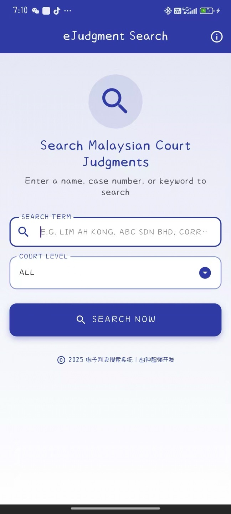
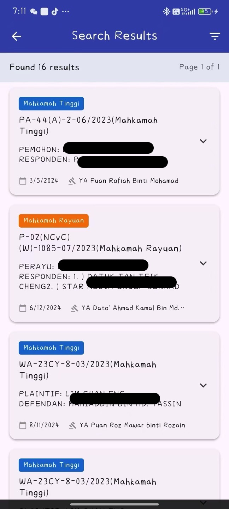
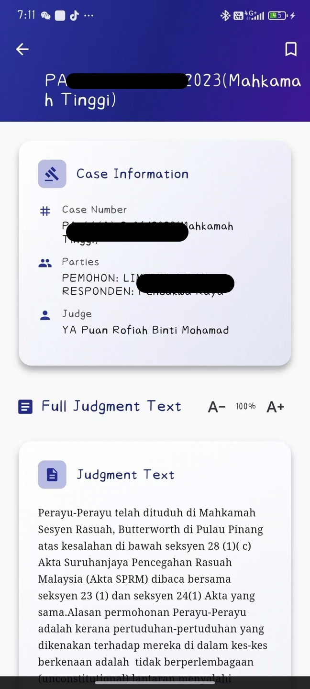

# Malaysia EJudgement App

<p align="center">
  <a href="https://github.com/ctkqiang/identity_scanner/actions/workflows/release.yml">
    
  </a>
  &nbsp;
  <a href="https://github.com/ctkqiang/identity_scanner/releases">
    
  </a>
</p>

## 项目简介

`Malaysia EJudgement` 是一款专为马来西亚法院设计的移动应用程序，旨在提供高效、便捷的电子判决搜索服务。本应用深度整合了马来西亚法院的官方 API，致力于为用户提供精准、实时的判决信息查询体验。我们怀着对马来西亚司法体系的敬意与热爱，倾力打造此应用，以期助力司法信息化建设。

## 主要功能

- **电子判决搜索**：通过关键词、案件编号、日期等多种条件，快速检索马来西亚法院的电子判决文书。
- **判决详情查看**：清晰展示判决文书的详细内容，包括案情、判决结果、法官意见等。
- **API 驱动**：所有数据均通过马来西亚法院官方 API 获取，确保信息的权威性与实时性。
- **用户友好界面**：简洁直观的用户界面设计，提供流畅的操作体验。

## 技术栈

本应用基于 Flutter 框架开发，旨在实现跨平台（Android 和 iOS）的统一体验。主要技术栈包括：

- **Flutter**：Google 开发的 UI 工具包，用于从单个代码库构建原生编译的移动、Web 和桌面应用程序。
- **Dart**：Flutter 应用的开发语言。
- **GetX**：一个高性能、易于使用的 Flutter 框架，用于状态管理、依赖注入和路由管理。
- **HTTP/Dio**：用于网络请求，与后端 API 进行高效通信。
- **JSON Serialization**：用于处理 API 返回的 JSON 数据。

## 安装与运行

### 环境准备

在运行本项目之前，请确保您的开发环境已安装以下工具：

- **Flutter SDK**：请参考 [Flutter 官方文档](https://docs.flutter.dev/get-started/install) 进行安装。
- **Dart SDK**：通常随 Flutter SDK 一同安装。
- **IDE**：推荐使用 Visual Studio Code 或 Android Studio。

### 克隆项目

```bash
git clone https://github.com/your_username/identity_scanner.git
cd identity_scanner
```

### 获取依赖

在项目根目录下运行以下命令，获取所有必要的 Dart 包依赖：

```bash
flutter pub get
```

### 运行应用

连接您的移动设备或启动模拟器，然后运行：

```bash
flutter run
```

## 项目结构

```
identity_scanner/
├── lib/
│   ├── business_logic/  # 业务逻辑层，处理核心业务流程
│   │   └── ejudgement_bl.dart
│   ├── controller/      # GetX 控制器，管理 UI 状态和业务逻辑交互
│   │   └── get.controller.dart
│   ├── main.dart        # 应用入口文件
│   ├── models/          # 数据模型定义，用于解析 API 数据
│   │   ├── ap_document.model.dart
│   │   ├── ejudgmenthelper.models.dart
│   │   ├── ejudgmentportalsearchresult.models.dart
│   │   ├── ejudgmentresponse.models.dart
│   │   ├── scanner_annotation.dart
│   │   └── search_item.models.dart
│   └── pages/           # UI 页面组件
│       ├── search_pages.dart
│       ├── show_file.dart
│       ├── show_full.dart
│       └── show_result_list.dart
├── assets/              # 静态资源，如图片、字体等
├── android/             # Android 平台相关配置
├── ios/                 # iOS 平台相关配置
├── pubspec.yaml         # 项目依赖和元数据文件
└── README.md            # 项目说明文档
```

## 效果展示

<p align="center">
  
  
  
</p>

## 贡献

欢迎对本项目提出改进意见或贡献代码。请遵循以下步骤：

1. Fork 本仓库。
2. 创建新的功能分支 (`git checkout -b feature/YourFeature`)。
3. 提交您的更改 (`git commit -am 'Add some feature'`)。
4. 推送至分支 (`git push origin feature/YourFeature`)。
5. 提交 Pull Request。

## 许可证

本项目采用 MIT 许可证。详情请参阅 `LICENSE` 文件。

## 联系我们

如果您有任何问题或建议，请通过 [您的邮箱/联系方式] 与我们联系。

---

> This app is built dedicated to Malaysian Court with Love, powered by their API
